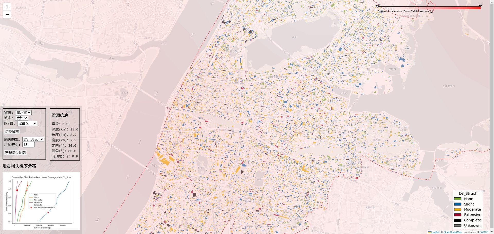

# CNCityRisk-web

CNCityRisk-web 是一个用于展示城市风险评估结果的 Web 应用程序，使用 Flask 框架构建。

## [网站地址](http://106.15.93.61/)

[](http://106.15.93.61/)

## 说明文档

* [文档](https://youtian95.github.io/2025/01/09/CNCityRiskMap/)

## 使用Docker部署

### 前提条件

- 安装 [Docker](https://www.docker.com/get-started)
- 安装 [Docker Compose](https://docs.docker.com/compose/install/)

### 部署步骤

1. 克隆仓库：
    ```bash
    git clone https://github.com/youtian95/CNCityRisk-web.git
    cd CNCityRisk-web
    ```

2. 配置API密钥：
    ```bash
    # 创建或编辑config.ini文件
    vim config.ini
    ```
    添加以下内容：
    ```ini
    [API]
    api_key_OpenTopography = your_key
    api_key_TDT = your_key
    ```

3. 确保损失图结果数据文件已上传到`CNCityRiskWeb/static/maps`目录。

4. 构建并启动Docker容器：
    ```bash
    docker-compose up -d
    ```

5. 访问应用：
    浏览器打开 `http://localhost` 即可访问应用。

### 技术说明

- 本Docker配置使用Miniconda作为基础镜像
- GDAL库通过conda安装，避免了版本不匹配问题
- 其他Python依赖通过pip安装
- 应用在conda虚拟环境中运行

### 更新应用

当代码有更新时，运行以下命令重新构建并启动容器：

```bash
git pull
docker-compose up -d --build
```

### 查看日志

```bash
docker-compose logs -f
```

### 停止应用

```bash
docker-compose down
```

## 部署到服务器

### 配置环境

1. 克隆仓库：
    ```bash
    git clone https://github.com/youtian95/CNCityRisk-web.git
    ```
1. 使用conda创建虚拟环境并激活：
    ```bash
    source ~/.bashrc
    cd CNCityRisk-web
    conda create -p ./env python=3.12
    conda activate ./env
    ```
1. 将安装包`cncityrisk-0.1.1-py3-none-any.whl`上传到当前目录。
1. 安装依赖（GDAL用`pip install`会报错，所以先安装好特定版本）：
    ```bash
    conda install -c conda-forge GDAL=3.11.0
    pip install cncityrisk-0.1.1-py3-none-any.whl
    grep -v "GDAL==" requirements.txt > requirements_nogdal.txt
    pip install -r requirements_nogdal.txt
    ```
1. 将`maps.7z`损失图结果数据文件上传到`~/CNCityRisk-web/CNCityRiskWeb/static/maps`目录下。
1. 修改`~/CNCityRisk-web/.flaskenv`：
    ```bash
    vim ./.flaskenv
    ```
    修改为：
    ```
    FLASK_ENV=production
    FLASK_DEBUG=FALSE
    ...
    ```
1. 添加`config.ini`文件：
    ```bash
    vim config.ini
    ```
    添加以下内容：
    ```ini
    [API]
    api_key_OpenTopography = your_key
    api_key_TDT = your_key
    ```

### 使用 Gunicorn 运行应用

Gunicorn 是一个 WSGI 服务器，用于运行 Flask 应用，并将其作为后台服务。

1. 安装 Gunicorn
    ```
    pip install gunicorn
    ```
2. 运行 Flask 应用（`&`在后台运行）：
    ```bash
    gunicorn -w 4 -b 0.0.0.0:8000 wsgi:app &
    ```

### 配置 Nginx 作为反向代理

将所有来自外部的请求转发到 Gunicorn 来处理。

1. 安装 Nginx：
    ```bash
    sudo apt-get install nginx
    ```

2. 创建 Nginx 配置文件：
    ```bash
    sudo vim /etc/nginx/sites-available/cncityrisk-web
    ```

    添加以下内容：
    ```nginx
    server {
        listen 80;
        server_name your_domain_or_IP; # 替换为你的域名或服务器的IP

        location / {
            proxy_pass http://127.0.0.1:8000;
            proxy_set_header Host $host;
            proxy_set_header X-Real-IP $remote_addr;
            proxy_set_header X-Forwarded-For $proxy_add_x_forwarded_for;
            proxy_set_header X-Forwarded-Proto $scheme;
        }
    }
    ```
1. 使用符号链接将配置文件链接到 sites-enabled：
    ```bash
    sudo ln -s /etc/nginx/sites-available/cncityrisk-web /etc/nginx/sites-enabled
    ```
1. 启用配置并重启 Nginx：
    ```bash
    sudo systemctl restart nginx
    ```

### 完成

在浏览器中打开 `http://your_domain_or_IP` 查看应用程序。

## 更新服务器上的代码

1. 拉取最新代码：
    ```bash
    cd ~/CNCityRisk-web
    git pull
    ```

1. 上传建筑数据文件`.\CNCityRisk\Data\BldData\`到`cncityrisk`包中的相应位置，上传地图数据文件`CNCityRisk-web\CNCityRiskWeb\static\maps\maps.7z`，上传安装包`cncityrisk-0.1.0-py3-none-any.whl`

1. 更新依赖：
    ```bash
    pip install cncityrisk-0.1.0-py3-none-any.whl
    pip install -r requirements.txt
    ```

1. 重启 Gunicorn 服务：
    ```bash
    sudo systemctl restart gunicorn
    ```

1. 重启 Nginx 服务：
    ```bash
    sudo systemctl restart nginx
    ```

## 本地开发

启动开发服务器：
    ```powershell
    flask run
    ```
