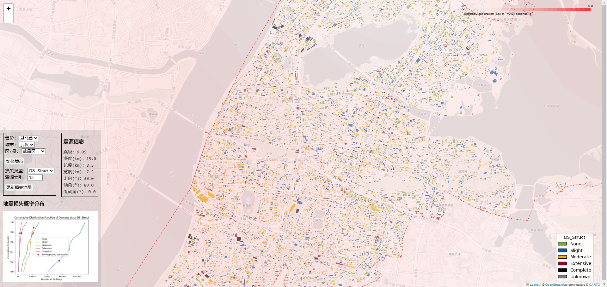

# CNCityRisk-web

CNCityRisk-web 是一个用于展示城市风险评估结果的 Web 应用程序，使用 Flask 框架构建。
  
- 网站地址：[https://cncityrisk.youtian95.cn/](http://cncityrisk.youtian95.cn/)
- CHANGELOG: [CHANGELOG.md](CHANGELOG.md)

[](http://cncityrisk.youtian95.cn/)

## 本地开发

### 本地调试

  ```bash
  python -m flask run
  ```

  然后访问 [http://localhost:8000/](http://localhost:8000/) 。

### 本地运行容器

  ```bash
  docker compose up -d --build
  ```

  然后可访问 [http://localhost:8000/](http://localhost:8000/) 。

### 需要的数据文件

程序运行时需要以下目录和文件：

1. 建筑群损失矢量瓦片（MBTiles）
   - 目录：`CNCityRiskWeb/static/maps/mbtiles/`
   - 文件：`RegionalLoss_{城市}_{LossType}_{iSim}_ogr2ogr.mbtiles`

2. 建筑群损失统计（JSON）
   - 目录：`CNCityRiskWeb/static/maps/RegionalLossStatistics/{城市}/`
   - 文件：
     - `RegionalLossStatistics_DS_Struct.json`
     - `RegionalLossStatistics_RepairCost_Total.json`
     - `RegionalLossStatistics_RepairTime.json`

3. IM 云图数据（HDF5）
   - 目录：`CNCityRiskWeb/static/maps/IMmap/`
   - 文件：`IM_mapdata_{城市}.hdf5`

4. 震源信息（CSV）
   - 目录：`CNCityRiskWeb/static/maps/Ruptures/`
   - 文件：`{城市}.csv`

5. 年化风险（CSV）
   - 目录：`CNCityRiskWeb/static/maps/AnnualizedRisk/{城市}/`
   - 文件：
     - `mean_annual_freq_mag.csv`
     - `mean_annual_freq_RepairCost_Total.csv`
     - `mean_annual_freq_RepairTime.csv`
     - `mean_annual_loss_with_year_RepairCost_Total.csv`
     - `mean_annual_loss_with_year_RepairTime.csv`

## 部署

### 服务器部署

1. 在服务器上克隆代码:

    ```bash
    git clone https://github.com/youtian95/CNCityRisk-web.git CNCityRisk
    cd CNCityRisk
    ```

1. 上传 maps 数据到服务器目录（代码仓库默认不包含 maps 大文件）:

    ```bash
    # 目标目录
    CNCityRiskWeb/static/maps/
    ```

1. 在服务器本地构建并启动:

    ```bash
    docker compose up -d --build
    ```

1. 1Panel 配置反向代理
   1. 创建网站
   2. 反向代理
      - 域名：`cncityrisk.youtian95.cn`
      - 代理地址：`http://容器ip:8000`
   3. 添加安全证书
   4. 开启反向代理缓存（提高地图加载速度）
      - 路径 `/tiles/*`：缓存 7 天
      - 路径 `/get_city_coordinates*`：缓存 1 小时
      - 路径 `/get_city_all_ruptures/*`：缓存 1 小时
      - 路径 `/get_map_data*`：缓存 5 分钟

### 更新应用

当应用需要更新时:

```bash
# 在服务器上
cd CNCityRisk
git pull
docker compose down
docker compose up -d --build
```

### 停止应用

```bash
docker compose down
```
